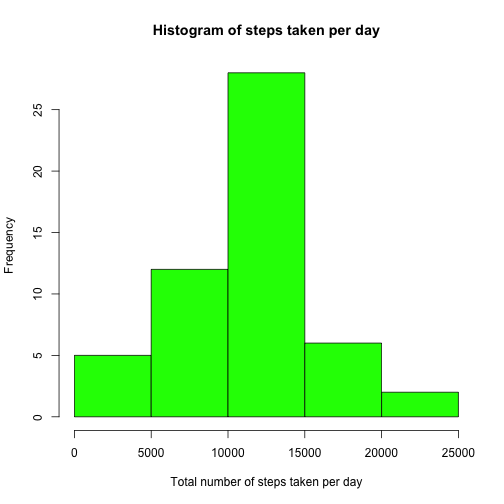
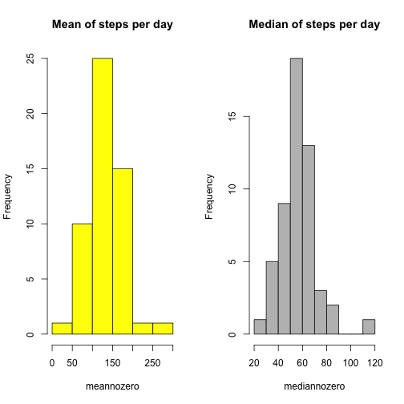
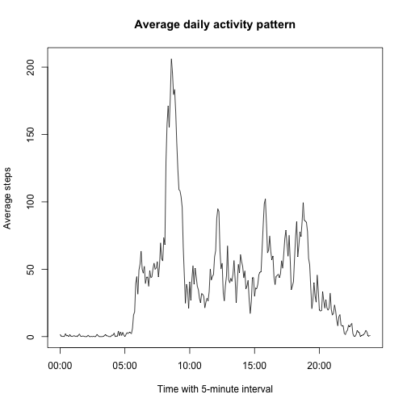
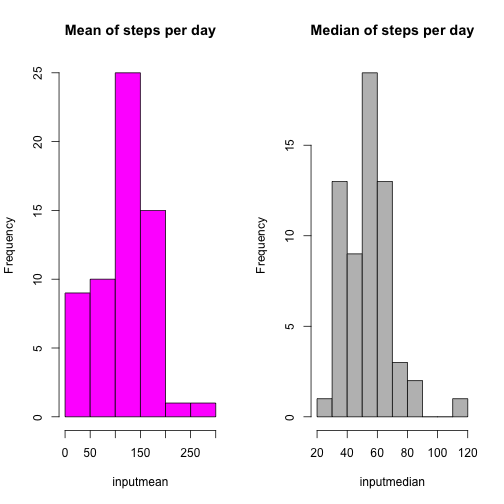
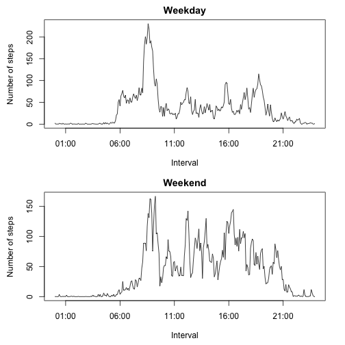
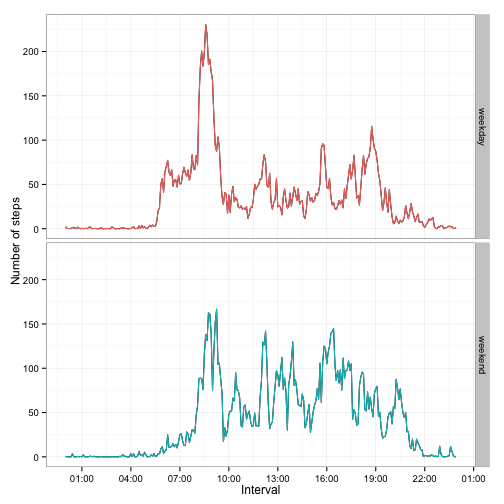

This R markdown document is to answer the first peer assignment of the course *Reproducible Research* in [Coursera](https://class.coursera.org/repdata-012/).

## Introduction

>It is now possible to collect a large amount of data about personal movement using activity monitoring devices such as a Fitbit, Nike Fuelband, or Jawbone Up. These type of devices are part of the “quantified self” movement – a group of enthusiasts who take measurements about themselves regularly to improve their health, to find patterns in their behavior, or
because they are tech geeks. But these data remain under-utilized both because the raw data are hard to obtain and there is a lack of statistical methods and software for processing and interpreting the data.

Base on the back ground knowledge above, we have to answer several questions about the assigned dataset. Questions are listed as following:

- **What is the mean total number of steps taken per day?**
- **What is the average daily activity pattern?**
- **Inputing missing values**
- **Are there differences in activity patterns between weekdays and weekends?**

## Activity Monitoring Data
Download dataset: [Activity monitoring data](https://d396qusza40orc.cloudfront.net/repdata%2Fdata%2Factivity.zip) [52K]

List of Variables:

1. **steps** : Number of steps taking in a 5-minute interval (missing values are coded as `NA`).
2. **date** : The date on which the measurement was taken in YYYY-MM-DD format.
3. **interval** : Identifier for the 5-minute interval in which measurement was taken.

*The dataset is stored in a comma-separated-value (CSV) file and there are a total of 17,568 observations in this dataset.*

We could have a quick view of this dataset as below:

```r
library("knitr")
opts_chunk$set(echo= TRUE, results= 'asis')
```

   steps       date interval
1     NA 2012-10-01        0
2     NA 2012-10-01        5
3     NA 2012-10-01       10
4     NA 2012-10-01       15
5     NA 2012-10-01       20
6     NA 2012-10-01       25
7     NA 2012-10-01       30
8     NA 2012-10-01       35
9     NA 2012-10-01       40
10    NA 2012-10-01       45
11    NA 2012-10-01       50
12    NA 2012-10-01       55
13    NA 2012-10-01      100
14    NA 2012-10-01      105
15    NA 2012-10-01      110

For analysis purpose, transform the **date** varible to POSIXt format by the packgae "lubridate". 


```r
library("lubridate")
activity$date<- ymd(activity$date)
class(activity$date)
```

[1] "POSIXct" "POSIXt" 

```r
library("xtable")
print(xtable(summary(activity)), type= "html")
```

<!-- html table generated in R 3.1.2 by xtable 1.7-4 package -->
<!-- Fri Mar 13 23:46:39 2015 -->
<table border=1>
<tr> <th>  </th> <th>     steps </th> <th>      date </th> <th>    interval </th>  </tr>
  <tr> <td align="right"> 1 </td> <td> Min.   :  0.00   </td> <td> Min.   :2012-10-01   </td> <td> Min.   :   0.0   </td> </tr>
  <tr> <td align="right"> 2 </td> <td> 1st Qu.:  0.00   </td> <td> 1st Qu.:2012-10-16   </td> <td> 1st Qu.: 588.8   </td> </tr>
  <tr> <td align="right"> 3 </td> <td> Median :  0.00   </td> <td> Median :2012-10-31   </td> <td> Median :1177.5   </td> </tr>
  <tr> <td align="right"> 4 </td> <td> Mean   : 37.38   </td> <td> Mean   :2012-10-31   </td> <td> Mean   :1177.5   </td> </tr>
  <tr> <td align="right"> 5 </td> <td> 3rd Qu.: 12.00   </td> <td> 3rd Qu.:2012-11-15   </td> <td> 3rd Qu.:1766.2   </td> </tr>
  <tr> <td align="right"> 6 </td> <td> Max.   :806.00   </td> <td> Max.   :2012-11-30   </td> <td> Max.   :2355.0   </td> </tr>
  <tr> <td align="right"> 7 </td> <td> NA's   :2304   </td> <td>  </td> <td>  </td> </tr>
   </table>

```r
nrow(activity)
```

[1] 17568

As the summary above, we know that variable **steps** included 2304 `NA`s in 17568 observations, and **date** recorded from 2012-10-01 to 2012-11-30 (total 2 months, 61 days). **interval** listed from 0, 5, 10, 15, ..., 2350, 2355 per day, with some gaps between it. i.e. with every 5 minutes, a measurment was taken, total 288 measurements recorded per day in the 61-day period.

Now we can move on to analyze data and then answer the questions.

## Questions
### What is the mean total number of steps taken per day?
##### 1. Calculate the total number of steps per day.

```r
# Set up a clean subset with no NAs in "steps".
# In order to avoid R counts the NAs as "0" by na.rm=TRUE, causing the misleaded total value, a clean subset is created to exclude those NAs totally.

cleanact<- subset(activity, activity$steps != "NA")

# Calculate the sum per day by tapply
sumperday<- tapply(cleanact$steps, cleanact$date, sum)
tokable<- function(data){
        kable(as.data.frame(data), format="markdown", align="c", digits= 12, col.names= "steps per day")
}
tokable(sumperday)
```


|           | steps per day |
|:----------|:-------------:|
|2012-10-02 |      126      |
|2012-10-03 |     11352     |
|2012-10-04 |     12116     |
|2012-10-05 |     13294     |
|2012-10-06 |     15420     |
|2012-10-07 |     11015     |
|2012-10-09 |     12811     |
|2012-10-10 |     9900      |
|2012-10-11 |     10304     |
|2012-10-12 |     17382     |
|2012-10-13 |     12426     |
|2012-10-14 |     15098     |
|2012-10-15 |     10139     |
|2012-10-16 |     15084     |
|2012-10-17 |     13452     |
|2012-10-18 |     10056     |
|2012-10-19 |     11829     |
|2012-10-20 |     10395     |
|2012-10-21 |     8821      |
|2012-10-22 |     13460     |
|2012-10-23 |     8918      |
|2012-10-24 |     8355      |
|2012-10-25 |     2492      |
|2012-10-26 |     6778      |
|2012-10-27 |     10119     |
|2012-10-28 |     11458     |
|2012-10-29 |     5018      |
|2012-10-30 |     9819      |
|2012-10-31 |     15414     |
|2012-11-02 |     10600     |
|2012-11-03 |     10571     |
|2012-11-05 |     10439     |
|2012-11-06 |     8334      |
|2012-11-07 |     12883     |
|2012-11-08 |     3219      |
|2012-11-11 |     12608     |
|2012-11-12 |     10765     |
|2012-11-13 |     7336      |
|2012-11-15 |      41       |
|2012-11-16 |     5441      |
|2012-11-17 |     14339     |
|2012-11-18 |     15110     |
|2012-11-19 |     8841      |
|2012-11-20 |     4472      |
|2012-11-21 |     12787     |
|2012-11-22 |     20427     |
|2012-11-23 |     21194     |
|2012-11-24 |     14478     |
|2012-11-25 |     11834     |
|2012-11-26 |     11162     |
|2012-11-27 |     13646     |
|2012-11-28 |     10183     |
|2012-11-29 |     7047      |


##### 2. Make a histogram of the total number of steps taken each day.

```r
hist(sumperday, col= "green", main= "Histogram of steps taken per day", xlab= "Total number of steps taken per day")
```

 


##### 3. Calculate and report the mean and median of the total number of steps taken per day.


```r
meanperday<- tapply(cleanact$steps, cleanact$date, mean)
medianperday<- tapply(cleanact$steps, cleanact$date, median)

# report the mean and median first by table.
library("knitr")
kable(cbind(meanperday, medianperday), format= "markdown", col.names= c("Mean of steps per day", "Median of steps per day"), align= c('c', 'c'))
```


|           | Mean of steps per day | Median of steps per day |
|:----------|:---------------------:|:-----------------------:|
|2012-10-02 |       0.4375000       |            0            |
|2012-10-03 |      39.4166667       |            0            |
|2012-10-04 |      42.0694444       |            0            |
|2012-10-05 |      46.1597222       |            0            |
|2012-10-06 |      53.5416667       |            0            |
|2012-10-07 |      38.2465278       |            0            |
|2012-10-09 |      44.4826389       |            0            |
|2012-10-10 |      34.3750000       |            0            |
|2012-10-11 |      35.7777778       |            0            |
|2012-10-12 |      60.3541667       |            0            |
|2012-10-13 |      43.1458333       |            0            |
|2012-10-14 |      52.4236111       |            0            |
|2012-10-15 |      35.2048611       |            0            |
|2012-10-16 |      52.3750000       |            0            |
|2012-10-17 |      46.7083333       |            0            |
|2012-10-18 |      34.9166667       |            0            |
|2012-10-19 |      41.0729167       |            0            |
|2012-10-20 |      36.0937500       |            0            |
|2012-10-21 |      30.6284722       |            0            |
|2012-10-22 |      46.7361111       |            0            |
|2012-10-23 |      30.9652778       |            0            |
|2012-10-24 |      29.0104167       |            0            |
|2012-10-25 |       8.6527778       |            0            |
|2012-10-26 |      23.5347222       |            0            |
|2012-10-27 |      35.1354167       |            0            |
|2012-10-28 |      39.7847222       |            0            |
|2012-10-29 |      17.4236111       |            0            |
|2012-10-30 |      34.0937500       |            0            |
|2012-10-31 |      53.5208333       |            0            |
|2012-11-02 |      36.8055556       |            0            |
|2012-11-03 |      36.7048611       |            0            |
|2012-11-05 |      36.2465278       |            0            |
|2012-11-06 |      28.9375000       |            0            |
|2012-11-07 |      44.7326389       |            0            |
|2012-11-08 |      11.1770833       |            0            |
|2012-11-11 |      43.7777778       |            0            |
|2012-11-12 |      37.3784722       |            0            |
|2012-11-13 |      25.4722222       |            0            |
|2012-11-15 |       0.1423611       |            0            |
|2012-11-16 |      18.8923611       |            0            |
|2012-11-17 |      49.7881944       |            0            |
|2012-11-18 |      52.4652778       |            0            |
|2012-11-19 |      30.6979167       |            0            |
|2012-11-20 |      15.5277778       |            0            |
|2012-11-21 |      44.3993056       |            0            |
|2012-11-22 |      70.9270833       |            0            |
|2012-11-23 |      73.5902778       |            0            |
|2012-11-24 |      50.2708333       |            0            |
|2012-11-25 |      41.0902778       |            0            |
|2012-11-26 |      38.7569444       |            0            |
|2012-11-27 |      47.3819444       |            0            |
|2012-11-28 |      35.3576389       |            0            |
|2012-11-29 |      24.4687500       |            0            |

Since all the medians of steps per days are reported as '0', just need to add a quick check if over 50% of the steps in a day are '0'.


```r
zeros<- subset(cleanact, cleanact$steps == 0)
table0<- tapply(zeros$steps, zeros$date, length)
tokable(table0)
```


|           | steps per day |
|:----------|:-------------:|
|2012-10-02 |      286      |
|2012-10-03 |      207      |
|2012-10-04 |      188      |
|2012-10-05 |      202      |
|2012-10-06 |      182      |
|2012-10-07 |      180      |
|2012-10-09 |      193      |
|2012-10-10 |      184      |
|2012-10-11 |      213      |
|2012-10-12 |      177      |
|2012-10-13 |      184      |
|2012-10-14 |      194      |
|2012-10-15 |      211      |
|2012-10-16 |      192      |
|2012-10-17 |      200      |
|2012-10-18 |      222      |
|2012-10-19 |      195      |
|2012-10-20 |      205      |
|2012-10-21 |      197      |
|2012-10-22 |      201      |
|2012-10-23 |      200      |
|2012-10-24 |      208      |
|2012-10-25 |      244      |
|2012-10-26 |      200      |
|2012-10-27 |      213      |
|2012-10-28 |      184      |
|2012-10-29 |      226      |
|2012-10-30 |      199      |
|2012-10-31 |      202      |
|2012-11-02 |      214      |
|2012-11-03 |      198      |
|2012-11-05 |      214      |
|2012-11-06 |      205      |
|2012-11-07 |      193      |
|2012-11-08 |      236      |
|2012-11-11 |      193      |
|2012-11-12 |      219      |
|2012-11-13 |      207      |
|2012-11-15 |      286      |
|2012-11-16 |      227      |
|2012-11-17 |      210      |
|2012-11-18 |      195      |
|2012-11-19 |      213      |
|2012-11-20 |      241      |
|2012-11-21 |      220      |
|2012-11-22 |      173      |
|2012-11-23 |      204      |
|2012-11-24 |      206      |
|2012-11-25 |      204      |
|2012-11-26 |      201      |
|2012-11-27 |      202      |
|2012-11-28 |      240      |
|2012-11-29 |      224      |

```r
# As we know that there are total 288 observation per day, check if there is any of the 0 counts less than 288/2= 144.
any(table0<= 144)
```

[1] FALSE

With the result "FALSE", we know that the median '0' was correct. However, it leads to meaningless output to our question. Therefore, we should try to recalculate the mean and median **WITHOUT the '0' steps**. The new results are listed as below.


```r
nozerostep<- subset(cleanact, cleanact$steps != 0)
meannozero<- tapply(nozerostep$steps, nozerostep$date, mean)
mediannozero<- tapply(nozerostep$steps, nozerostep$date, median)
library("knitr")
kable(cbind(meannozero, mediannozero), format= "markdown", col.names= c("Mean of steps per day (without 0 steps)", "Median of steps per day (without 0 steps)"), align= c('c', 'c'))
```


|           | Mean of steps per day (without 0 steps) | Median of steps per day (without 0 steps) |
|:----------|:---------------------------------------:|:-----------------------------------------:|
|2012-10-02 |                63.00000                 |                   63.0                    |
|2012-10-03 |                140.14815                |                   61.0                    |
|2012-10-04 |                121.16000                |                   56.5                    |
|2012-10-05 |                154.58140                |                   66.0                    |
|2012-10-06 |                145.47170                |                   67.0                    |
|2012-10-07 |                101.99074                |                   52.5                    |
|2012-10-09 |                134.85263                |                   48.0                    |
|2012-10-10 |                95.19231                 |                   56.5                    |
|2012-10-11 |                137.38667                |                   35.0                    |
|2012-10-12 |                156.59459                |                   46.0                    |
|2012-10-13 |                119.48077                |                   45.5                    |
|2012-10-14 |                160.61702                |                   60.5                    |
|2012-10-15 |                131.67532                |                   54.0                    |
|2012-10-16 |                157.12500                |                   64.0                    |
|2012-10-17 |                152.86364                |                   61.5                    |
|2012-10-18 |                152.36364                |                   52.5                    |
|2012-10-19 |                127.19355                |                   74.0                    |
|2012-10-20 |                125.24096                |                   49.0                    |
|2012-10-21 |                96.93407                 |                   48.0                    |
|2012-10-22 |                154.71264                |                   52.0                    |
|2012-10-23 |                101.34091                |                   56.0                    |
|2012-10-24 |                104.43750                |                   51.5                    |
|2012-10-25 |                56.63636                 |                   35.0                    |
|2012-10-26 |                77.02273                 |                   36.5                    |
|2012-10-27 |                134.92000                |                   72.0                    |
|2012-10-28 |                110.17308                |                   61.0                    |
|2012-10-29 |                80.93548                 |                   54.5                    |
|2012-10-30 |                110.32584                |                   40.0                    |
|2012-10-31 |                179.23256                |                   83.5                    |
|2012-11-02 |                143.24324                |                   55.5                    |
|2012-11-03 |                117.45556                |                   59.0                    |
|2012-11-05 |                141.06757                |                   66.0                    |
|2012-11-06 |                100.40964                |                   52.0                    |
|2012-11-07 |                135.61053                |                   58.0                    |
|2012-11-08 |                61.90385                 |                   42.5                    |
|2012-11-11 |                132.71579                |                   55.0                    |
|2012-11-12 |                156.01449                |                   42.0                    |
|2012-11-13 |                90.56790                 |                   57.0                    |
|2012-11-15 |                20.50000                 |                   20.5                    |
|2012-11-16 |                89.19672                 |                   43.0                    |
|2012-11-17 |                183.83333                |                   65.5                    |
|2012-11-18 |                162.47312                |                   80.0                    |
|2012-11-19 |                117.88000                |                   34.0                    |
|2012-11-20 |                95.14894                 |                   58.0                    |
|2012-11-21 |                188.04412                |                   55.0                    |
|2012-11-22 |                177.62609                |                   65.0                    |
|2012-11-23 |                252.30952                |                   113.0                   |
|2012-11-24 |                176.56098                |                   65.5                    |
|2012-11-25 |                140.88095                |                   84.0                    |
|2012-11-26 |                128.29885                |                   53.0                    |
|2012-11-27 |                158.67442                |                   57.0                    |
|2012-11-28 |                212.14583                |                   70.0                    |
|2012-11-29 |                110.10938                |                   44.5                    |


View means and median of steps per day by histogram plots. Data is processed without steps = 0, which means we only look at the data when user was moving.


```r
par(mfrow= c(1,2))
hist(meannozero, col= 119, main= "Mean of steps per day")
hist(mediannozero, col= 368, main= "Median of steps per day")
```

 


### What is the average daily activity pattern?


##### 1. Make a time series plot (i.e. `type = "l"`) of the 5-minute interval (x-axis) and the average number of steps taken, averaged across all days (y-axis).


When looking closely into the **interval** data, it is worth noting that intervals should be converted to format of TIME (i.e. %H%M) for plotting a time-series data. Otherwise, there will be a gap between "55"" to next interval "100". As we know that the TIME interval between 55 (00:55) and 100 (01:00) is only 5 minutes, while R would count it as a 45 interval.


To solve this issue, we could use `sprintf()` function in R, to formatting the original interval data into a fixed 4-digit number, and then transform it to time.
For detail information, here's a great reference in the [Cookbook for R](http://www.cookbook-r.com/Strings/Creating_strings_from_variables/#using-sprintf).


```r
# Add a new column to combine the time transformed from the orginal interval.
cleanact$time<- sprintf("%04d", cleanact$interval)
cleanact$time<- strptime(cleanact$time, format= "%H%M")

interperday<- tapply(cleanact$steps, cleanact$interval, mean)

# Make a time series plot
plot(unique(cleanact$time), interperday, type="l", main= "Average daily activity pattern", xlab= "Time with 5-minute interval", ylab= "Average steps")
```

 


##### 2. Which 5-minute interval, on average across all the days in the dataset, contains the maximum number of steps?


```r
interperday[interperday == max(interperday)]
```

     835 
206.1698 


Within this dataset, interval **835** (08:35) has the maximum average number of steps = **206.1698**. It was also shown in the plot above.


### Imputing missing values
>Note that there are a number of days/intervals where there are missing values (coded as NA). The presence of missing days may introduce bias into some calculations or summaries of the data.

##### 1. Calculate and report the total number of missing values in the dataset (i.e. the total number of rows with `NA`s)

Although we had already learned from the `summary()` result above that the total number of rows with `NA` is 2304, and `NA`s are only appeared in the column **steps**. We can also access this result by alternative ways, ex: `is.na()`.


```r
sum(is.na(activity))
```

[1] 2304

##### 2. Devise a strategy for filling in all of the missing values in the dataset. The strategy does not need to be sophisticated. For example, you could use the mean/median for that day, or the mean for that 5-minute interval, etc.

I would choose the mean for that 5-minute interval as the data to replace NA values. As we know that this dataset is reporting the movement activity (i.e. steps in each time of the day), it would be more reasonable to allocate the average steps. We could assume that these users tend to do the same amount of activity in certain time period: walking more during the day time, and merely moved between midnight and early morning.
There's another advantage of using the mean for the interval instead of mean for the day. we could avoid some cases that we don't even have any steps recorded in that day. In fact, we DO have this kind of issue in this dataset.

##### 3. Create a new dataset that is equal to the original dataset but with the missing data filled in.


```r
library("dplyr")
activity2<- activity %>% 
        mutate(input = ifelse(is.na(steps), interperday, steps))

print(xtable(summary(activity2)), type= "html")
```

<!-- html table generated in R 3.1.2 by xtable 1.7-4 package -->
<!-- Fri Mar 13 23:46:40 2015 -->
<table border=1>
<tr> <th>  </th> <th>     steps </th> <th>      date </th> <th>    interval </th> <th>     input </th>  </tr>
  <tr> <td align="right"> 1 </td> <td> Min.   :  0.00   </td> <td> Min.   :2012-10-01   </td> <td> Min.   :   0.0   </td> <td> Min.   :  0.00   </td> </tr>
  <tr> <td align="right"> 2 </td> <td> 1st Qu.:  0.00   </td> <td> 1st Qu.:2012-10-16   </td> <td> 1st Qu.: 588.8   </td> <td> 1st Qu.:  0.00   </td> </tr>
  <tr> <td align="right"> 3 </td> <td> Median :  0.00   </td> <td> Median :2012-10-31   </td> <td> Median :1177.5   </td> <td> Median :  0.00   </td> </tr>
  <tr> <td align="right"> 4 </td> <td> Mean   : 37.38   </td> <td> Mean   :2012-10-31   </td> <td> Mean   :1177.5   </td> <td> Mean   : 37.38   </td> </tr>
  <tr> <td align="right"> 5 </td> <td> 3rd Qu.: 12.00   </td> <td> 3rd Qu.:2012-11-15   </td> <td> 3rd Qu.:1766.2   </td> <td> 3rd Qu.: 27.00   </td> </tr>
  <tr> <td align="right"> 6 </td> <td> Max.   :806.00   </td> <td> Max.   :2012-11-30   </td> <td> Max.   :2355.0   </td> <td> Max.   :806.00   </td> </tr>
  <tr> <td align="right"> 7 </td> <td> NA's   :2304   </td> <td>  </td> <td>  </td> <td>  </td> </tr>
   </table>

We can see that the `NA`s are successfully replaced by the mean of each 5-minute interval. Variable **input** has exact the same min, mean, and max value with **steps**, and has no any `NA` found.

##### 4. Make a histogram of the total number of steps taken each day and Calculate and report the mean and median total number of steps taken per day. Do these values differ from the estimates from the first part of the assignment? What is the impact of imputing missing data on the estimates of the total daily number of steps?


```r
inputnot0<- subset(activity2, activity2$input != 0)

inputmean<- tapply(inputnot0$input, inputnot0$date, mean)
inputmedian<- tapply(inputnot0$input, inputnot0$date, median)

par(mfrow= c(1,2))
hist(inputmean, col= 366, main= "Mean of steps per day")
hist(inputmedian, col= 120, main= "Median of steps per day")
```

 

We can see that it looks identically to the one plotted in part 1, because in the part 1, dataset had already been filtered without NA and 0. 
However, the dataset might have changed after inputting the `NA`s. Let's take a quick look on the result of tapply.


```r
before<- tapply(activity$steps, activity$date, mean)
after<- tapply(activity2$input, activity2$date, mean)
kable(cbind(before, after), format= "markdown", col.names= c("Before inputing values to NA", "After inputing values to NA"), align= c('c', 'c'))
```


|           | Before inputing values to NA | After inputing values to NA |
|:----------|:----------------------------:|:---------------------------:|
|2012-10-01 |              NA              |         37.3825996          |
|2012-10-02 |          0.4375000           |          0.4375000          |
|2012-10-03 |          39.4166667          |         39.4166667          |
|2012-10-04 |          42.0694444          |         42.0694444          |
|2012-10-05 |          46.1597222          |         46.1597222          |
|2012-10-06 |          53.5416667          |         53.5416667          |
|2012-10-07 |          38.2465278          |         38.2465278          |
|2012-10-08 |              NA              |         37.3825996          |
|2012-10-09 |          44.4826389          |         44.4826389          |
|2012-10-10 |          34.3750000          |         34.3750000          |
|2012-10-11 |          35.7777778          |         35.7777778          |
|2012-10-12 |          60.3541667          |         60.3541667          |
|2012-10-13 |          43.1458333          |         43.1458333          |
|2012-10-14 |          52.4236111          |         52.4236111          |
|2012-10-15 |          35.2048611          |         35.2048611          |
|2012-10-16 |          52.3750000          |         52.3750000          |
|2012-10-17 |          46.7083333          |         46.7083333          |
|2012-10-18 |          34.9166667          |         34.9166667          |
|2012-10-19 |          41.0729167          |         41.0729167          |
|2012-10-20 |          36.0937500          |         36.0937500          |
|2012-10-21 |          30.6284722          |         30.6284722          |
|2012-10-22 |          46.7361111          |         46.7361111          |
|2012-10-23 |          30.9652778          |         30.9652778          |
|2012-10-24 |          29.0104167          |         29.0104167          |
|2012-10-25 |          8.6527778           |          8.6527778          |
|2012-10-26 |          23.5347222          |         23.5347222          |
|2012-10-27 |          35.1354167          |         35.1354167          |
|2012-10-28 |          39.7847222          |         39.7847222          |
|2012-10-29 |          17.4236111          |         17.4236111          |
|2012-10-30 |          34.0937500          |         34.0937500          |
|2012-10-31 |          53.5208333          |         53.5208333          |
|2012-11-01 |              NA              |         37.3825996          |
|2012-11-02 |          36.8055556          |         36.8055556          |
|2012-11-03 |          36.7048611          |         36.7048611          |
|2012-11-04 |              NA              |         37.3825996          |
|2012-11-05 |          36.2465278          |         36.2465278          |
|2012-11-06 |          28.9375000          |         28.9375000          |
|2012-11-07 |          44.7326389          |         44.7326389          |
|2012-11-08 |          11.1770833          |         11.1770833          |
|2012-11-09 |              NA              |         37.3825996          |
|2012-11-10 |              NA              |         37.3825996          |
|2012-11-11 |          43.7777778          |         43.7777778          |
|2012-11-12 |          37.3784722          |         37.3784722          |
|2012-11-13 |          25.4722222          |         25.4722222          |
|2012-11-14 |              NA              |         37.3825996          |
|2012-11-15 |          0.1423611           |          0.1423611          |
|2012-11-16 |          18.8923611          |         18.8923611          |
|2012-11-17 |          49.7881944          |         49.7881944          |
|2012-11-18 |          52.4652778          |         52.4652778          |
|2012-11-19 |          30.6979167          |         30.6979167          |
|2012-11-20 |          15.5277778          |         15.5277778          |
|2012-11-21 |          44.3993056          |         44.3993056          |
|2012-11-22 |          70.9270833          |         70.9270833          |
|2012-11-23 |          73.5902778          |         73.5902778          |
|2012-11-24 |          50.2708333          |         50.2708333          |
|2012-11-25 |          41.0902778          |         41.0902778          |
|2012-11-26 |          38.7569444          |         38.7569444          |
|2012-11-27 |          47.3819444          |         47.3819444          |
|2012-11-28 |          35.3576389          |         35.3576389          |
|2012-11-29 |          24.4687500          |         24.4687500          |
|2012-11-30 |              NA              |         37.3825996          |

All the missing means are BACK!!!
Those `NA`s would post an impact on estimating the total number of steps taken per day, as we would not count those `NA` as an effective value.
As we input `NA` with means or other alternative strategies, they will be replaced by a relatively "neutral" value that may not affect the final result, while no any missing values will interupt our analysis.


### Are there differences in activity patterns between weekdays and weekends?


##### 1. Create a new factor variable in the dataset with two levels – “weekday” and “weekend” indicating whether a given date is a weekday or weekend day.


```r
library("dplyr")
library("lubridate")
activity2<- activity2 %>% 
        mutate(weekday = ifelse(wday(ymd(date), label= TRUE, abbr=TRUE) == "Sun" | wday(ymd(date), label= TRUE, abbr=TRUE) == "Sat", "weekend", "weekday"))

table(activity2$weekday)
```


weekday weekend 
  12960    4608 

##### 2. Make a panel plot containing a time series plot (i.e. type = "l") of the 5-minute interval (x-axis) and the average number of steps taken, averaged across all weekday days or weekend days (y-axis). See the README file in the GitHub repository to see an example of what this plot should look like using simulated data.


As per instruction, we could choose any of the system we want. So let just start from the basic.


```r
# Again, tidy up the "interval" factors for time series plotting.

activity2$time<- sprintf("%04d", activity2$interval)
activity2$time<- strptime(activity2$time, format= "%H%M")

#Since we are using the average number of steps taken across all weekday or weekend, we need to seperate the dataset by the 'weekday' factor.

meanset<- function(data, factor){
        sub<- subset(data, weekday==factor)
        tapply(sub$input, sub$interval, mean)}

weekday<- meanset(activity2, "weekday")
weekend<- meanset(activity2, "weekend")
utime<- unique(activity2$time)

#Basic Plotting
par(mfrow=c(2,1), mar= c(4.5, 4.5, 2, 2))
plot(utime, weekday, type= "l", main= "Weekday", xlab= "Interval", ylab= "Number of steps")
plot(utime, weekend, type= "l", main= "Weekend", xlab= "Interval", ylab= "Number of steps")
```

 


The plot above was made by Basic Plotting system, so it looks kind of boring...
Since the example was made by Lattice system, we could try the **ggplot2** to get a different view.


```r
plotset<- data.frame(weekday, weekend, utime)
colnames(plotset)<- c("weekday","weekend", "time")

library("tidyr")
plotsetm<- gather(plotset, weekdays, steps, -time)

library("ggplot2")
library("scales")
q<- qplot(time, steps, data= plotsetm, geom="line", facets= weekdays ~., xlab= "Interval", ylab= "Number of steps")
q + theme_bw() + geom_line(aes(colour= weekdays)) + theme(legend.position="none") + scale_x_datetime(breaks = date_breaks("3 hour"), labels = date_format("%H:%M"))
```

 


Now we get a prettier one!!! Great.


And back to the quetsion, they are apparently different patterns for "weekday" and "weekend".
As the patterns shown, the users of monitoring devices took more steps on weekends. During weekdays, they moved frequently only in the morning (maybe moving to office or schools?), while they took steps more evenly in the day time of weekends.


**DONE!!**
