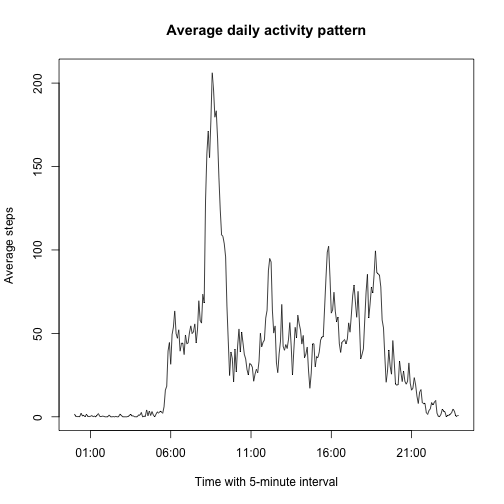

This R markdown document is to answer the first peer assignment of the course *Reproducible Research* in [Coursera](https://class.coursera.org/repdata-012/).

## Introduction

>It is now possible to collect a large amount of data about personal movement using activity monitoring devices such as a Fitbit, Nike Fuelband, or Jawbone Up. These type of devices are part of the “quantified self” movement – a group of enthusiasts who take measurements about themselves regularly to improve their health, to find patterns in their behavior, or
because they are tech geeks. But these data remain under-utilized both because the raw data are hard to obtain and there is a lack of statistical methods and software for processing and interpreting the data.

Base on the back ground knowledge above, we have to answer several questions about the assigned dataset. Questions are listed as following:

- **What is the mean total number of steps taken per day?**
- **What is the average daily activity pattern?**
- **Inputing missing values**
- **Are there differences in activity patterns between weekdays and weekends?**

## Activity Monitoring Data
Download dataset: [Activity monitoring data](https://d396qusza40orc.cloudfront.net/repdata%2Fdata%2Factivity.zip) [52K]

List of Variables:

1. **steps** : Number of steps taking in a 5-minute interval (missing values are coded as `NA`).
2. **date** : The date on which the measurement was taken in YYYY-MM-DD format.
3. **interval** : Identifier for the 5-minute interval in which measurement was taken.

*The dataset is stored in a comma-separated-value (CSV) file and there are a total of 17,568 observations in this dataset.*

We could have a quick view of this dataset as below:

   steps       date interval
1     NA 2012-10-01        0
2     NA 2012-10-01        5
3     NA 2012-10-01       10
4     NA 2012-10-01       15
5     NA 2012-10-01       20
6     NA 2012-10-01       25
7     NA 2012-10-01       30
8     NA 2012-10-01       35
9     NA 2012-10-01       40
10    NA 2012-10-01       45
11    NA 2012-10-01       50
12    NA 2012-10-01       55
13    NA 2012-10-01      100
14    NA 2012-10-01      105
15    NA 2012-10-01      110

For analysis purpose, transform the **date** varible to POSIXt format by the packgae "lubridate". 

[1] "POSIXct" "POSIXt" 
     steps             date               interval     
 Min.   :  0.00   Min.   :2012-10-01   Min.   :   0.0  
 1st Qu.:  0.00   1st Qu.:2012-10-16   1st Qu.: 588.8  
 Median :  0.00   Median :2012-10-31   Median :1177.5  
 Mean   : 37.38   Mean   :2012-10-31   Mean   :1177.5  
 3rd Qu.: 12.00   3rd Qu.:2012-11-15   3rd Qu.:1766.2  
 Max.   :806.00   Max.   :2012-11-30   Max.   :2355.0  
 NA's   :2304                                          
[1] 17568

As the summary above, we know that variable **steps** included 2304 `NA`s in 17568 observations, and **date** recorded from 2012-10-01 to 2012-11-30 (total 2 months, 61 days). **interval** listed from 0, 5, 10, 15, ..., 2350, 2355 per day, with some gaps between it. i.e. with every 5 minutes, a measurment was taken, total 288 measurements recorded per day in the 61-day period.

Now we can move on to analyze data and then answer the questions.

## Questions
### What is the mean total number of steps taken per day?
##### 1. Calculate the total number of steps per day.
2012-10-02 2012-10-03 2012-10-04 2012-10-05 2012-10-06 2012-10-07 
       126      11352      12116      13294      15420      11015 
2012-10-09 2012-10-10 2012-10-11 2012-10-12 2012-10-13 2012-10-14 
     12811       9900      10304      17382      12426      15098 
2012-10-15 2012-10-16 2012-10-17 2012-10-18 2012-10-19 2012-10-20 
     10139      15084      13452      10056      11829      10395 
2012-10-21 2012-10-22 2012-10-23 2012-10-24 2012-10-25 2012-10-26 
      8821      13460       8918       8355       2492       6778 
2012-10-27 2012-10-28 2012-10-29 2012-10-30 2012-10-31 2012-11-02 
     10119      11458       5018       9819      15414      10600 
2012-11-03 2012-11-05 2012-11-06 2012-11-07 2012-11-08 2012-11-11 
     10571      10439       8334      12883       3219      12608 
2012-11-12 2012-11-13 2012-11-15 2012-11-16 2012-11-17 2012-11-18 
     10765       7336         41       5441      14339      15110 
2012-11-19 2012-11-20 2012-11-21 2012-11-22 2012-11-23 2012-11-24 
      8841       4472      12787      20427      21194      14478 
2012-11-25 2012-11-26 2012-11-27 2012-11-28 2012-11-29 
     11834      11162      13646      10183       7047 

##### 2. Make a histogram of the total number of steps taken each day.
 

##### 3. Calculate and report the mean and median of the total number of steps taken per day.

|           | Mean of steps per day | Median of steps per day |
|:----------|:---------------------:|:-----------------------:|
|2012-10-02 |       0.4375000       |            0            |
|2012-10-03 |      39.4166667       |            0            |
|2012-10-04 |      42.0694444       |            0            |
|2012-10-05 |      46.1597222       |            0            |
|2012-10-06 |      53.5416667       |            0            |
|2012-10-07 |      38.2465278       |            0            |
|2012-10-09 |      44.4826389       |            0            |
|2012-10-10 |      34.3750000       |            0            |
|2012-10-11 |      35.7777778       |            0            |
|2012-10-12 |      60.3541667       |            0            |
|2012-10-13 |      43.1458333       |            0            |
|2012-10-14 |      52.4236111       |            0            |
|2012-10-15 |      35.2048611       |            0            |
|2012-10-16 |      52.3750000       |            0            |
|2012-10-17 |      46.7083333       |            0            |
|2012-10-18 |      34.9166667       |            0            |
|2012-10-19 |      41.0729167       |            0            |
|2012-10-20 |      36.0937500       |            0            |
|2012-10-21 |      30.6284722       |            0            |
|2012-10-22 |      46.7361111       |            0            |
|2012-10-23 |      30.9652778       |            0            |
|2012-10-24 |      29.0104167       |            0            |
|2012-10-25 |       8.6527778       |            0            |
|2012-10-26 |      23.5347222       |            0            |
|2012-10-27 |      35.1354167       |            0            |
|2012-10-28 |      39.7847222       |            0            |
|2012-10-29 |      17.4236111       |            0            |
|2012-10-30 |      34.0937500       |            0            |
|2012-10-31 |      53.5208333       |            0            |
|2012-11-02 |      36.8055556       |            0            |
|2012-11-03 |      36.7048611       |            0            |
|2012-11-05 |      36.2465278       |            0            |
|2012-11-06 |      28.9375000       |            0            |
|2012-11-07 |      44.7326389       |            0            |
|2012-11-08 |      11.1770833       |            0            |
|2012-11-11 |      43.7777778       |            0            |
|2012-11-12 |      37.3784722       |            0            |
|2012-11-13 |      25.4722222       |            0            |
|2012-11-15 |       0.1423611       |            0            |
|2012-11-16 |      18.8923611       |            0            |
|2012-11-17 |      49.7881944       |            0            |
|2012-11-18 |      52.4652778       |            0            |
|2012-11-19 |      30.6979167       |            0            |
|2012-11-20 |      15.5277778       |            0            |
|2012-11-21 |      44.3993056       |            0            |
|2012-11-22 |      70.9270833       |            0            |
|2012-11-23 |      73.5902778       |            0            |
|2012-11-24 |      50.2708333       |            0            |
|2012-11-25 |      41.0902778       |            0            |
|2012-11-26 |      38.7569444       |            0            |
|2012-11-27 |      47.3819444       |            0            |
|2012-11-28 |      35.3576389       |            0            |
|2012-11-29 |      24.4687500       |            0            |

Since all the medians of steps per days are reported as '0', just need to add a quick check if over 50% of the steps in a day are '0'.

2012-10-02 2012-10-03 2012-10-04 2012-10-05 2012-10-06 2012-10-07 
       286        207        188        202        182        180 
2012-10-09 2012-10-10 2012-10-11 2012-10-12 2012-10-13 2012-10-14 
       193        184        213        177        184        194 
2012-10-15 2012-10-16 2012-10-17 2012-10-18 2012-10-19 2012-10-20 
       211        192        200        222        195        205 
2012-10-21 2012-10-22 2012-10-23 2012-10-24 2012-10-25 2012-10-26 
       197        201        200        208        244        200 
2012-10-27 2012-10-28 2012-10-29 2012-10-30 2012-10-31 2012-11-02 
       213        184        226        199        202        214 
2012-11-03 2012-11-05 2012-11-06 2012-11-07 2012-11-08 2012-11-11 
       198        214        205        193        236        193 
2012-11-12 2012-11-13 2012-11-15 2012-11-16 2012-11-17 2012-11-18 
       219        207        286        227        210        195 
2012-11-19 2012-11-20 2012-11-21 2012-11-22 2012-11-23 2012-11-24 
       213        241        220        173        204        206 
2012-11-25 2012-11-26 2012-11-27 2012-11-28 2012-11-29 
       204        201        202        240        224 
[1] FALSE

With the result "FALSE", we know that the median '0' was correct. However, it leads to meaningless output to our question. Therefore, we should try to recalculate the mean and median **WITHOUT the '0' steps**. The new results are listed as below.

|           | Mean of steps per day (without 0 steps) | Median of steps per day (without 0 steps) |
|:----------|:---------------------------------------:|:-----------------------------------------:|
|2012-10-02 |                63.00000                 |                   63.0                    |
|2012-10-03 |                140.14815                |                   61.0                    |
|2012-10-04 |                121.16000                |                   56.5                    |
|2012-10-05 |                154.58140                |                   66.0                    |
|2012-10-06 |                145.47170                |                   67.0                    |
|2012-10-07 |                101.99074                |                   52.5                    |
|2012-10-09 |                134.85263                |                   48.0                    |
|2012-10-10 |                95.19231                 |                   56.5                    |
|2012-10-11 |                137.38667                |                   35.0                    |
|2012-10-12 |                156.59459                |                   46.0                    |
|2012-10-13 |                119.48077                |                   45.5                    |
|2012-10-14 |                160.61702                |                   60.5                    |
|2012-10-15 |                131.67532                |                   54.0                    |
|2012-10-16 |                157.12500                |                   64.0                    |
|2012-10-17 |                152.86364                |                   61.5                    |
|2012-10-18 |                152.36364                |                   52.5                    |
|2012-10-19 |                127.19355                |                   74.0                    |
|2012-10-20 |                125.24096                |                   49.0                    |
|2012-10-21 |                96.93407                 |                   48.0                    |
|2012-10-22 |                154.71264                |                   52.0                    |
|2012-10-23 |                101.34091                |                   56.0                    |
|2012-10-24 |                104.43750                |                   51.5                    |
|2012-10-25 |                56.63636                 |                   35.0                    |
|2012-10-26 |                77.02273                 |                   36.5                    |
|2012-10-27 |                134.92000                |                   72.0                    |
|2012-10-28 |                110.17308                |                   61.0                    |
|2012-10-29 |                80.93548                 |                   54.5                    |
|2012-10-30 |                110.32584                |                   40.0                    |
|2012-10-31 |                179.23256                |                   83.5                    |
|2012-11-02 |                143.24324                |                   55.5                    |
|2012-11-03 |                117.45556                |                   59.0                    |
|2012-11-05 |                141.06757                |                   66.0                    |
|2012-11-06 |                100.40964                |                   52.0                    |
|2012-11-07 |                135.61053                |                   58.0                    |
|2012-11-08 |                61.90385                 |                   42.5                    |
|2012-11-11 |                132.71579                |                   55.0                    |
|2012-11-12 |                156.01449                |                   42.0                    |
|2012-11-13 |                90.56790                 |                   57.0                    |
|2012-11-15 |                20.50000                 |                   20.5                    |
|2012-11-16 |                89.19672                 |                   43.0                    |
|2012-11-17 |                183.83333                |                   65.5                    |
|2012-11-18 |                162.47312                |                   80.0                    |
|2012-11-19 |                117.88000                |                   34.0                    |
|2012-11-20 |                95.14894                 |                   58.0                    |
|2012-11-21 |                188.04412                |                   55.0                    |
|2012-11-22 |                177.62609                |                   65.0                    |
|2012-11-23 |                252.30952                |                   113.0                   |
|2012-11-24 |                176.56098                |                   65.5                    |
|2012-11-25 |                140.88095                |                   84.0                    |
|2012-11-26 |                128.29885                |                   53.0                    |
|2012-11-27 |                158.67442                |                   57.0                    |
|2012-11-28 |                212.14583                |                   70.0                    |
|2012-11-29 |                110.10938                |                   44.5                    |

View means and median of steps per day by histogram plots. Data is processed without steps = 0, which means we only look at the data when user was moving.

 

### What is the average daily activity pattern?

##### 1. Make a time series plot (i.e. `type = "l"`) of the 5-minute interval (x-axis) and the average number of steps taken, averaged across all days (y-axis).

When looking closely into the **interval** data, it is worth noting that intervals should be converted to format of TIME (i.e. %H%M) for plotting a time-series data. Otherwise, there will be a gap between "55"" to next interval "100". As we know that the TIME interval between 55 (00:55) and 100 (01:00) is only 5 minutes, while R would count it as a 45 interval.

To solve this issue, we could use `sprintf()` function in R, to formatting the original interval data into a fixed 4-digit number, and then transform it to time.
For detail information, here's a great reference in the [Cookbook for R](http://www.cookbook-r.com/Strings/Creating_strings_from_variables/#using-sprintf).

 

##### 2. Which 5-minute interval, on average across all the days in the dataset, contains the maximum number of steps?

     835 
206.1698 

Within this dataset, interval **835** (08:35) has the maximum average number of steps = **206.1698**. It was also shown in the plot above.

### Imputing missing values
>Note that there are a number of days/intervals where there are missing values (coded as NA). The presence of missing days may introduce bias into some calculations or summaries of the data.

##### 1. Calculate and report the total number of missing values in the dataset (i.e. the total number of rows with `NA`s)

Although we had already learned from the `summary()` result above that the total number of rows with `NA` is 2304, and `NA`s are only appeared in the column **steps**. We can also access this result by alternative ways, ex: `is.na()`.

[1] 2304

##### 2. Devise a strategy for filling in all of the missing values in the dataset. The strategy does not need to be sophisticated. For example, you could use the mean/median for that day, or the mean for that 5-minute interval, etc.

I would choose the mean for that 5-minute interval as the data to replace NA values. As we know that this dataset is reporting the movement activity (i.e. steps in each time of the day), it would be more reasonable to allocate the average steps. We could assume that these users tend to do the same amount of activity in certain time period: walking more during the day time, and merely moved between midnight and early morning.
There's another advantage of using the mean for the interval instead of mean for the day. we could avoid some cases that we don't even have any steps recorded in that day. In fact, we DO have this kind of issue in this dataset.

##### 3. Create a new dataset that is equal to the original dataset but with the missing data filled in.

     steps             date               interval          input       
 Min.   :  0.00   Min.   :2012-10-01   Min.   :   0.0   Min.   :  0.00  
 1st Qu.:  0.00   1st Qu.:2012-10-16   1st Qu.: 588.8   1st Qu.:  0.00  
 Median :  0.00   Median :2012-10-31   Median :1177.5   Median :  0.00  
 Mean   : 37.38   Mean   :2012-10-31   Mean   :1177.5   Mean   : 37.38  
 3rd Qu.: 12.00   3rd Qu.:2012-11-15   3rd Qu.:1766.2   3rd Qu.: 27.00  
 Max.   :806.00   Max.   :2012-11-30   Max.   :2355.0   Max.   :806.00  
 NA's   :2304                                                           

We can see that the `NA`s are successfully replaced by the mean of each 5-minute interval. Variable **input** has exact the same min, mean, and max value with **steps**, and has no any `NA` found.

##### 4. Make a histogram of the total number of steps taken each day and Calculate and report the mean and median total number of steps taken per day. Do these values differ from the estimates from the first part of the assignment? What is the impact of imputing missing data on the estimates of the total daily number of steps?

 

We can see that it looks identically to the one plotted in part 1, because in the part 1, dataset had already been filtered without NA and 0. 
However, the dataset might have changed after inputting the `NA`s. Let's take a quick look on the result of tapply.

2012-10-02 2012-10-03 2012-10-04 2012-10-05 2012-10-06 2012-10-07 
 0.4375000 39.4166667 42.0694444 46.1597222 53.5416667 38.2465278 
2012-10-09 2012-10-10 2012-10-11 2012-10-12 2012-10-13 2012-10-14 
44.4826389 34.3750000 35.7777778 60.3541667 43.1458333 52.4236111 
2012-10-15 2012-10-16 2012-10-17 2012-10-18 2012-10-19 2012-10-20 
35.2048611 52.3750000 46.7083333 34.9166667 41.0729167 36.0937500 
2012-10-21 2012-10-22 2012-10-23 2012-10-24 2012-10-25 2012-10-26 
30.6284722 46.7361111 30.9652778 29.0104167  8.6527778 23.5347222 
2012-10-27 2012-10-28 2012-10-29 2012-10-30 2012-10-31 2012-11-02 
35.1354167 39.7847222 17.4236111 34.0937500 53.5208333 36.8055556 
2012-11-03 2012-11-05 2012-11-06 2012-11-07 2012-11-08 2012-11-11 
36.7048611 36.2465278 28.9375000 44.7326389 11.1770833 43.7777778 
2012-11-12 2012-11-13 2012-11-15 2012-11-16 2012-11-17 2012-11-18 
37.3784722 25.4722222  0.1423611 18.8923611 49.7881944 52.4652778 
2012-11-19 2012-11-20 2012-11-21 2012-11-22 2012-11-23 2012-11-24 
30.6979167 15.5277778 44.3993056 70.9270833 73.5902778 50.2708333 
2012-11-25 2012-11-26 2012-11-27 2012-11-28 2012-11-29 
41.0902778 38.7569444 47.3819444 35.3576389 24.4687500 
2012-10-01 2012-10-02 2012-10-03 2012-10-04 2012-10-05 2012-10-06 
37.3825996  0.4375000 39.4166667 42.0694444 46.1597222 53.5416667 
2012-10-07 2012-10-08 2012-10-09 2012-10-10 2012-10-11 2012-10-12 
38.2465278 37.3825996 44.4826389 34.3750000 35.7777778 60.3541667 
2012-10-13 2012-10-14 2012-10-15 2012-10-16 2012-10-17 2012-10-18 
43.1458333 52.4236111 35.2048611 52.3750000 46.7083333 34.9166667 
2012-10-19 2012-10-20 2012-10-21 2012-10-22 2012-10-23 2012-10-24 
41.0729167 36.0937500 30.6284722 46.7361111 30.9652778 29.0104167 
2012-10-25 2012-10-26 2012-10-27 2012-10-28 2012-10-29 2012-10-30 
 8.6527778 23.5347222 35.1354167 39.7847222 17.4236111 34.0937500 
2012-10-31 2012-11-01 2012-11-02 2012-11-03 2012-11-04 2012-11-05 
53.5208333 37.3825996 36.8055556 36.7048611 37.3825996 36.2465278 
2012-11-06 2012-11-07 2012-11-08 2012-11-09 2012-11-10 2012-11-11 
28.9375000 44.7326389 11.1770833 37.3825996 37.3825996 43.7777778 
2012-11-12 2012-11-13 2012-11-14 2012-11-15 2012-11-16 2012-11-17 
37.3784722 25.4722222 37.3825996  0.1423611 18.8923611 49.7881944 
2012-11-18 2012-11-19 2012-11-20 2012-11-21 2012-11-22 2012-11-23 
52.4652778 30.6979167 15.5277778 44.3993056 70.9270833 73.5902778 
2012-11-24 2012-11-25 2012-11-26 2012-11-27 2012-11-28 2012-11-29 
50.2708333 41.0902778 38.7569444 47.3819444 35.3576389 24.4687500 
2012-11-30 
37.3825996 

The missing date **2012-10-01** and **2012-11-15** are BACK!!!

### Are there differences in activity patterns between weekdays and weekends?

##### 1. Create a new factor variable in the dataset with two levels – “weekday” and “weekend” indicating whether a given date is a weekday or weekend day.

weekday weekend 
  12960    4608 

##### 2. Make a panel plot containing a time series plot (i.e. type = "l") of the 5-minute interval (x-axis) and the average number of steps taken, averaged across all weekday days or weekend days (y-axis). See the README file in the GitHub repository to see an example of what this plot should look like using simulated data.

As per instruction, we could choose any of the system we want. So let just start from the basic.

 

The plot above was made by Bacis Plotting system, so it looks kind of boring...
Since the example was made by Lattice system, we could try the **ggplot2** to get a different view.

 

Now we get a prettier one!!! Great.

And back to the quetsion, they are apparently different patterns for "weekday" and "weekend".
As the patterns shown, the users of monitoring devices took more steps on weekends. During weekdays, they moved frequently only in the morning (maybe moving to office or schools?), while they took steps more evenly in the day time of weekends.

**DONE!!**
